---
{"dg-publish":true,"permalink":"/Transfer Box/Frankenstein – By Mary Shelley (1818)/"}
---

# 🧟‍♂️ Frankenstein 
*By Mary Shelley (1818)*  

---

## **Characters**
| **Character** | **Emoji** | **Role** |
|---------------|-----------|----------|
| Victor 🧪⚡ | 🧪⚡ | Ambitious scientist, creator of the Creature |
| Creature 👹💔 | 👹💔 | Victor's creation, rejected by all, seeks love and revenge |
| Elizabeth 🌹🕊️ | 🌹🕊️ | Victor's cousin/fiancée, symbol of feminine ideal |
| Walton ❄️🗺️ | ❄️🗺️ | Explorer framing the narrative |
| Justine ⚖️ | ⚖️ | Wrongly accused servant, executed unjustly |
| Clerval 🎻 | 🎻 | Victor's loyal best friend, symbol of compassion |
| Alphonse 👴 | 👴 | Victor’s father, represents traditional family duty |

---

## **Narrative Flow**

```mermaid
graph TD

    %% Walton's Framing Narrative
    subgraph "❄️ Walton's Arctic Frame Story"
        W1[Walton - Ambitious Explorer - Seeks Glory & Companionship]
        W2[Finds Victor - Near Death - Takes Him Aboard]
        W3[Victor Begins Tale - A Warning Against Hubris]
    end

    %% Victor's Early Life and Ambition
    subgraph "🧪 Victor's Origins and Hubris"
        V1[Happy Childhood in Geneva - With Elizabeth 🌹]
        V2[Mother's Death - Desire to Conquer Death]
        V3[Studies at Ingolstadt - Fascinated by Science]
        V4[Discovers Secret of Life - 'To Pour Light Into the World']
        V5[Creates Creature 👹 - Horror & Disgust]
        V6[Abandons Creature - Irresponsible Creator]
    end

    %% Creature's Journey and Rejection
    subgraph "👹 Creature's Growth and Rejection"
        C1[Awakens Innocent & Curious - Blank Slate]
        C2[Learns Language & Empathy by Observing De Lacey Family]
        C3[Attempts to Connect - Violently Rejected]
        C4[Society's Cruelty Turns Him Bitter - 'I am Malicious Because I am Miserable']
        C5[Murders William - Plants Evidence on Justine ⚖️]
        C6[Justine Executed - Innocent Victim of Injustice]
        C7[Confronts Victor - Demands Female Companion]
    end

    %% Female Creature Arc
    subgraph "🌹 Feminine Power and Fear"
        F1[Victor Travels to Remote Islands to Create Female Creature]
        F2[Fears She Might Reproduce or Rebel]
        F3[Destroys Female Creature - Symbolic Silencing of Women]
        F4[Creature's Rage - Swears Revenge: 'I Shall Be With You On Your Wedding Night']
    end

    %% Revenge Cycle and Climax
    subgraph "🔥 Revenge and Tragedy"
        R1[Victor Marries Elizabeth 🌹 Despite Ominous Threat]
        R2[Creature Murders Elizabeth on Wedding Night]
        R3[Victor's Father Dies of Grief]
        R4[Victor Now Consumed by Hatred - Mirrors His Creation]
    end

    %% Arctic Pursuit and Ending
    subgraph "❄️ Final Arctic Pursuit"
        A1[Victor Pursues Creature Across Frozen Wastes]
        A2[Found by Walton - Warns Against Ambition]
        A3[Victor Dies - Tragic End of the Creator]
        A4[Creature Appears - Mourns Victor & His Own Existence]
        A5[Vows to End His Life - Disappears Into the Ice]
    end

    %% Flow Connections
    W1 --> W2 --> W3
    W3 --> V1 --> V2 --> V3 --> V4 --> V5 --> V6
    V6 --> C1 --> C2 --> C3 --> C4 --> C5 --> C6 --> C7
    C7 --> F1 --> F2 --> F3 --> F4
    F4 --> R1 --> R2 --> R3 --> R4
    R4 --> A1 --> A2 --> A3 --> A4 --> A5

    %% Cross-storyline thematic links
    V4 -. Hubris .-> F2
    C4 -. Society's Rejection .-> R2
    F3 -. Feminist Erasure .-> R2
    W1 -. Mirror Ambition .-> V4

    %% Styles
    style W1 fill:#457b9d,stroke:#1d3557,stroke-width:2px,color:#fff
    style W2 fill:#457b9d,stroke:#1d3557,stroke-width:2px,color:#fff
    style W3 fill:#457b9d,stroke:#1d3557,stroke-width:2px,color:#fff

    style V1 fill:#f4a261,stroke:#e76f51,stroke-width:2px
    style V2 fill:#f4a261,stroke:#e76f51,stroke-width:2px
    style V3 fill:#f4a261,stroke:#e76f51,stroke-width:2px
    style V4 fill:#f4a261,stroke:#e76f51,stroke-width:2px
    style V5 fill:#e63946,stroke:#9b2226,stroke-width:2px,color:#fff
    style V6 fill:#e63946,stroke:#9b2226,stroke-width:2px,color:#fff

    style C1 fill:#90be6d,stroke:#4a7c2d,stroke-width:2px
    style C2 fill:#90be6d,stroke:#4a7c2d,stroke-width:2px
    style C3 fill:#90be6d,stroke:#4a7c2d,stroke-width:2px
    style C4 fill:#e9c46a,stroke:#ca6702,stroke-width:2px
    style C5 fill:#e9c46a,stroke:#ca6702,stroke-width:2px
    style C6 fill:#e9c46a,stroke:#ca6702,stroke-width:2px
    style C7 fill:#e9c46a,stroke:#ca6702,stroke-width:2px

    style F1 fill:#ffb4a2,stroke:#9b2226,stroke-width:2px
    style F2 fill:#ffb4a2,stroke:#9b2226,stroke-width:2px
    style F3 fill:#ffb4a2,stroke:#9b2226,stroke-width:2px
    style F4 fill:#ffb4a2,stroke:#9b2226,stroke-width:2px

    style R1 fill:#9b5de5,stroke:#3a0ca3,stroke-width:2px,color:#fff
    style R2 fill:#9b5de5,stroke:#3a0ca3,stroke-width:2px,color:#fff
    style R3 fill:#9b5de5,stroke:#3a0ca3,stroke-width:2px,color:#fff
    style R4 fill:#9b5de5,stroke:#3a0ca3,stroke-width:2px,color:#fff

    style A1 fill:#457b9d,stroke:#1d3557,stroke-width:2px,color:#fff
    style A2 fill:#457b9d,stroke:#1d3557,stroke-width:2px,color:#fff
    style A3 fill:#457b9d,stroke:#1d3557,stroke-width:2px,color:#fff
    style A4 fill:#457b9d,stroke:#1d3557,stroke-width:2px,color:#fff
    style A5 fill:#457b9d,stroke:#1d3557,stroke-width:2px,color:#fff
```

# **Frankenstein – The Modern Prometheus** 🧪⚡❄️
## **Act 1: The Frame Story** ❄️

**Walton ❄️** writes letters to his sister, describing his **Arctic expedition** and thirst for discovery.

- Walton’s ambition mirrors Victor’s later tragedy.
- He longs for **“one friend who would share my dreams.”**
- His crew discovers **Victor 🧪**, near death, chasing a **mysterious figure (👹)** across the ice.
- Walton nurses Victor, who begins to recount his story as a **warning against unbridled ambition**.
    
    > _“You seek for knowledge and wisdom, as I once did; and I ardently hope that the gratification of your wishes may not be a serpent to sting you, as mine has been.”_
    

---

## **Act 2: Origins of Obsession** 🌱

Victor grows up in **Geneva**, surrounded by love and privilege.

- His parents **adopt Elizabeth 🌹**, whom Victor sees as his “promised companion.”
- Childhood ideal: harmony, innocence, natural joy.
    
    > _“No human being could have passed a happier childhood than myself.”_
    

### **Early Fascinations**

- Victor becomes obsessed with **ancient alchemists** like Cornelius Agrippa.
- When exposed to **modern science**, he combines mystical wonder with rational ambition.
- **Mother’s Death:** Elizabeth falls ill, and Victor’s mother dies nursing her — sparking his obsession with **conquering death**.

---

## **Act 3: The Creation** ⚡

At **Ingolstadt University**, Victor dives into study, isolating himself completely.

- He develops the **secret of life**, driven by Promethean ambition:
    
    > _“Life and death appeared to me ideal bounds, which I should first break through, and pour a torrent of light into our dark world.”_
    

### **The Monster is Born**

- After two years of feverish work, Victor assembles a **creature from dead body parts**.
    
- When it **awakens**, Victor is overwhelmed by **revulsion**:
    
    > _“How can I describe my emotions at this catastrophe, or how delineate the wretch whom with such infinite pains and care I had endeavoured to form?”_  
    > _“I had desired it with an ardour that far exceeded moderation; but now that I had finished, the beauty of the dream vanished, and breathless horror and disgust filled my heart.”_
    
- Victor **abandons the Creature 👹**, fleeing into the night.
    
- When he returns, **the Creature has vanished**, leaving Victor haunted and sickened.
    

---

## **Act 4: Tragedy in Geneva** 🌩️

Victor receives news: **William 🧸**, his youngest brother, has been **murdered**.

- In the woods, Victor **sees the Creature** and realizes it is responsible.
- However, **Justine ⚖️**, the family’s servant, is **framed** for the murder.
- Victor’s silence condemns her to execution:
    
    > _“Justine died, she rested, and I was alive.”_
    

This marks the first **irreversible consequence** of Victor’s abandonment.

---

## **Act 5: The Creature’s Story** 👁️

The Creature confronts Victor, pleading to be heard.

- **His Journey:**
    - Awakens in confusion and innocence, like a newborn.
    - Experiences **pain, hunger, cold**, slowly learning through trial and error.
    - Secretly observes the **DeLacey 👁️ family**, learning **language**, **history**, and **morality**.
        
        > _“I ought to be thy Adam, but I am rather the fallen angel.”_
        
    - When he reveals himself, humans **reject him violently**, even the kind DeLacey family.
        
        > _“I am malicious because I am miserable.”_
        

### **Demand for Companionship**

- The Creature begs Victor:
    
    > _“Make me happy, and I shall again be virtuous.”_
    
- He longs for a **mate**, someone to share his isolation.
- Victor reluctantly **agrees**, fearing the Creature’s growing hatred.

---

## **Act 6: The Failed Promise** 💔

Victor begins creating a **female creature**, but as he works:

- He fears the **two might reproduce**, creating a **race of monsters**.
- In a moment of terror, he **destroys the female companion** before completion.
    
    > _“The remains of the half-finished creature lay scattered on the floor, lifeless and inanimate.”_
    

### **Creature’s Vow of Revenge**

- The Creature witnesses this destruction and swears **eternal vengeance**:
    
    > _“I shall be with you on your wedding night.”_
    

---

## **Act 7: The Cycle of Revenge** 🔪

- **Henry Clerval 📚**, Victor’s best friend, is **murdered** by the Creature.
    
- Victor is briefly imprisoned, deepening his despair.
    
- Despite the warning, Victor marries **Elizabeth 🌹**.
    
- On their wedding night, the Creature **strikes**, killing Elizabeth:
    
    > _“She was there, lifeless and inanimate, thrown across the bed, her head hanging down.”_
    
- Victor’s father **Alphonse 👴** dies of grief soon after.
    
- With nothing left to lose, Victor vows to **hunt the Creature to the ends of the Earth**.
    

---

## **Act 8: The Arctic Pursuit** ❄️

Victor chases the Creature **across continents**, into the **frozen Arctic wilderness**.

- The pursuit is symbolic of their **unbreakable bond of hatred and obsession**.
- Both figures are now completely isolated, mirroring each other’s torment.

Victor collapses, near death, and is rescued by **Walton ❄️**.

---

## **Act 9: Victor’s Final Warning** ⚰️

Victor tells Walton his story, urging him not to repeat his mistakes.

- He sees Walton’s ambition as a reflection of his own:
    
    > _“Learn from me, if not by my precepts, at least by my example, how dangerous is the acquirement of knowledge.”_
    

Victor dies, leaving the **Creature’s fate unresolved**.

---

## **Act 10: The Creature’s Lament** 👹

Walton encounters the **Creature**, mourning Victor’s death.

- The Creature expresses deep **regret and anguish**:
    
    > _“I, who irretrievably destroyed him, have not his spirit to endure my own misery.”_
    
- He declares he will **end his life** by drifting away on an ice raft, disappearing into the **frozen fog**, symbolizing endless suffering and existential despair.
    

---

## **Philosophical Depth**

### **1. Promethean Hubris** 🔥

- Victor as **Modern Prometheus** – seeking godlike power without foresight.
- Science without ethics leads to destruction.

### **2. Alienation and Society** 🌍

- Creature’s innate goodness corrupted by **societal rejection**, echoing **Rousseau’s social contract**.
- Evil is not born, but **created through suffering**.

### **3. Creator’s Responsibility** 🧪👹

- Victor’s refusal to **care for his creation** mirrors neglectful parenting.
- The Creature becomes a reflection of **Victor’s guilt**.

### **4. Nature vs. Enlightenment Rationalism** 🌲⚡

- Sublime landscapes embody **Romantic reverence for nature**.
- Victor’s science represents Enlightenment rationalism’s cold detachment.

### **5. The Double (Doppelgänger Theme)** 🪞

- Victor and the Creature are **two sides of the same psyche** — ambition vs. suffering.
- Their chase symbolizes self-destruction.

---

## **Core Philosophical Themes**
| **Theme** | **Explanation** | **Key Quote** |
|-----------|----------------|---------------|
| 🧪 **Hubris of Science** | Victor’s desire to surpass natural limits leads to destruction. | *“Learn from me... how dangerous is the acquirement of knowledge.”* |
| 🌹 **Silenced Women** | Women are passive, voiceless, or destroyed; highlights patriarchal erasure. | Elizabeth’s murder & destruction of female creature |
| 👁️ **Appearance vs. Reality** | Creature judged as monstrous for looks, not actions. | *“I am malicious because I am miserable.”* |
| ⚖️ **Justice and Injustice** | Justine’s execution and Creature’s suffering critique systemic injustice. | *“The tortured sufferer... did not deserve to die.”* |
| ❄️ **Isolation vs. Connection** | Lack of nurturing bonds leads to violence and despair. | Walton’s desire for companionship |
| 🧬 **Reproductive Politics** | Victor bypasses women in creation, symbolizing fear of female power. | *“She might refuse to comply with a compact...”* |

---

## **Feminist Interpretations**
### **1. Authorship and Historical Feminist Context**

- **Mary Shelley 🪶**, daughter of **Mary Wollstonecraft**, the pioneering feminist author of _A Vindication of the Rights of Woman_.
    - Wollstonecraft argued that women were **denied education and agency**, forced into passive roles by patriarchal society.
    - Mary Shelley grew up in a radical intellectual environment shaped by these ideals, witnessing firsthand the **consequences of female powerlessness**.
- Written in **1818**, during a time when women were excluded from scientific, political, and philosophical arenas.
    - _Frankenstein_ can be seen as Mary Shelley **inserting a female perspective** into a male-dominated Romantic and Enlightenment tradition.

---

### **2. Creation Without Women: The Monstrous Birth**

#### **Victor 🧪 as "Male Mother"**

- Victor **usurps the female role of giving birth** by creating life through science, bypassing women entirely.
    - This reflects the **fear of and desire to control female reproductive power**.
    - His act is unnatural and ultimately catastrophic: a **"monstrous birth."**
- Victor’s horror at the Creature’s animation parallels **postpartum trauma**, but with **no nurturing bond**, only revulsion.
    
    > _“I had desired it with an ardour that far exceeded moderation; but now that I had finished, the beauty of the dream vanished, and breathless horror and disgust filled my heart.”_
    

**Feminist Reading:**

- Male scientists seek power without responsibility, symbolizing how patriarchal structures **appropriate creation while devaluing motherhood**.
- The absence of a maternal figure results in **violence, alienation, and destruction**.

---

### **3. Erasure of Female Voices**

Women in _Frankenstein_ are consistently **silenced, passive, or destroyed**, reflecting how patriarchal society marginalizes women:

- **Elizabeth 🌹** – Idealized as a passive angel figure, ultimately **murdered on her wedding night**, symbolizing women sacrificed to male ambition.
- **Justine ⚖️** – Wrongly accused of William’s murder and executed, representing **women scapegoated by a corrupt justice system**.
- **Victor’s Mother** – Dies early, setting the stage for **male-dominated creation**.
- **Female Creature** – Destroyed before she can even be born, denying the Creature companionship and **symbolizing men’s fear of uncontrolled female sexuality and reproduction**.
    
    > Victor: _“She might become ten thousand times more malignant than her mate and delight, for its own sake, in murder and wretchedness.”_
    

**Feminist Insight:**  
The **systematic silencing** of women mirrors their lack of voice in Mary Shelley’s society. Their absence **causes imbalance**, suggesting that without women's presence and perspective, **male ambition runs rampant and destructive**.

---

### **4. The Creature as the "Feminized Other"**

The **Creature 👹** himself can be read as a metaphor for **women under patriarchy**:

- Born innocent but **rejected by society**, just as women are excluded from power.
- Labeled as monstrous **not because of innate evil**, but because of **others’ perceptions and fears**.
    
    > _“I am malicious because I am miserable.”_
    
- His lack of agency mirrors women’s **lack of social power**, forced into reactive roles.
- His plea for a mate reflects a **desire for connection and equality**, denied by Victor’s authoritarian control.

**Feminist Paradox:**

- The Creature is both **victim and avenger**, embodying suppressed anger at systemic oppression.

---

### **5. Fear of Female Sexuality**

Victor’s destruction of the **female creature** exposes deep fears about women’s reproductive independence:

- He worries she may **choose her own path**, beyond his control:
    
    > _“She might refuse to comply with a compact made before her creation.”_
    
- Fear that she could **reproduce**, creating a "race of monsters," mirrors patriarchal fear of women’s **unregulated sexual agency**.
- The violent destruction of her body is symbolic of **historical violence against women** who defy male authority.

---

### **6. Critique of Enlightenment Rationalism**

- Victor’s scientific ambition represents the **male Enlightenment ideal**: rational, controlling, and detached.
- In contrast, the **Romantic sublime**—seen in nature, feelings, and relationships—is feminized and associated with balance and nurture.
- By privileging masculine rationality over feminine empathy, Victor **destroys harmony** and unleashes chaos.

---

### **7. Walton ❄️ as a Mirror and Alternative**

- Walton’s frame narrative shows another **ambitious man**, paralleling Victor.
- However, Walton **listens to Victor’s warning** and **chooses to turn back**, symbolizing a possible escape from destructive masculinity.
    - Walton’s letters to his sister represent **female presence as moral anchor**, though still voiceless.

---

### **8. Mary Shelley’s Personal Feminist Subtext**

- Mary Shelley herself experienced the **dangers of female marginalization**:
    - Her mother died giving birth to her.
    - She lost multiple children in infancy, shaping her depiction of grief and maternal loss.
    - As a woman writer, she had to **publish anonymously** to be taken seriously.
- _Frankenstein_ becomes a **coded critique of women’s erasure** in intellectual and scientific spheres.

---

### **Most Powerful Feminist Quotes**

- Victor, on the female creature:  
    >_“She might refuse to comply with a compact made before her creation.”_
- Creature, on rejection:  
    >_“I ought to be thy Adam, but I am rather the fallen angel.”_
- Victor’s final warning:  
    >_“Learn from me, if not by my precepts, at least by my example, how dangerous is the acquirement of knowledge.”_
- Mary Shelley’s implicit critique: through **absence**, every destroyed or silenced woman in the novel **speaks through tragedy**.

---

## Inspirations/Imitations from her personal life
### **1. Motherhood, Death, and the Monstrous Birth**

- Mary Shelley **lost her mother**, feminist icon **Mary Wollstonecraft**, 10 days after she was born.
    
    - This left Mary haunted by the **idea of death in childbirth**, a theme baked into _Frankenstein_.
    - The **Creature’s unnatural birth** mirrors Mary’s guilt and fear about her own existence — _she herself was a “creation” that caused a woman’s death_.
    - Victor’s act of creating life **without a woman** is a twisted inversion of the mother-child bond.
- **Mary’s personal tragedy:**
    
    - She gave birth to **four children**, three of whom died in infancy.
    - She literally wrote _Frankenstein_ after **burying her first baby**, who died just weeks after birth.
    - Her journal after the baby’s death:
        
        > _“Dream that my little baby came to life again; that it had only been cold, and that we rubbed it before the fire and it lived.”_
        
    - This is **the very image of Victor animating the Creature**.
        - Frankenstein’s lab = Mary’s grief-stricken fantasy of reversing death.
- **The destroyed female creature** = Mary’s own **terror of childbirth** and societal fear of uncontrolled female sexuality.
    
    - Victor literally rips apart the possibility of female reproduction, just as Mary’s world ripped away her children.

---

### **2. Percy Bysshe Shelley = Victor Frankenstein 🧪**

Mary’s husband, **Percy Shelley**, was a brilliant but **self-absorbed radical poet**.

- He **preached free love**, rejected traditional morality, and abandoned people (including his first wife, Harriet, who later killed herself).
- Percy pressured Mary into a bohemian lifestyle, but he was **reckless and emotionally cold**, much like Victor.

**Victor mirrors Percy’s behavior:**

- Victor creates life then **runs away from responsibility**.
- Percy fathered children but left others to suffer — Harriet’s suicide parallels Justine’s execution, a woman destroyed by male selfishness.
- Victor’s obsession with “discovery” = Percy’s obsession with art and fame at the expense of human connections.

> _The novel can be read as Mary subconsciously accusing Percy of being a “monster-maker” who abandoned the women in his life._

---

### **3. The Creature = Mary Herself 👹💔**

The Creature’s arc of **isolation, rejection, and rage** mirrors Mary’s life experience:

- Mary was **ostracized by society** for running away with Percy at age 16, just like the Creature is rejected for simply existing.
- The Creature’s desire for love and belonging reflects Mary’s desperate longing for **recognition and affection** in a patriarchal world.
    - _“I am malicious because I am miserable.”_ — this could be Mary’s cry against the society that shamed her.
- When the Creature speaks to Victor:
    
    > _“I ought to be thy Adam, but I am rather the fallen angel.”_
    
    - Mary felt like this toward her father, **William Godwin**, who adored her half-siblings but grew cold to Mary after she eloped with Percy.

**Victor = Father Figure, Creature = Mary:**

- Godwin (like Victor) **created Mary through ideas and upbringing**, but then **rejected her** for her scandalous choices.
- Mary internalized this rejection, pouring it into the Creature’s lonely existence.

---

### **4. The Silenced Women: Mary’s Rage Against Patriarchy**

Every major female character in _Frankenstein_ is **silent, passive, or murdered**:

- **Elizabeth 🌹** is idealized but voiceless, killed on her wedding night.
- **Justine ⚖️** is falsely accused and executed without justice.
- **Female Creature** is **literally torn apart** before she can speak.

This isn’t accidental — it’s Mary exposing how women in her world were **denied agency and destroyed by male ambition**.

- The destruction of the female creature symbolizes **men’s fear of female power**, particularly **female sexuality and reproduction**.
- Victor bypasses women entirely by **usurping the power of childbirth**, but his creation is monstrous precisely because **it lacks love and nurturing**.

> _Frankenstein is a novel about what happens when men try to play god while silencing women’s voices: destruction, chaos, and endless grief._

---

### **5. Walton = Mary’s Own Duality ❄️**

- Walton, the ambitious explorer, mirrors Mary’s **intellectual side**, yearning for greatness in a world that limits her as a woman.
- But Walton listens and learns from Victor’s story, ultimately **turning back**, symbolizing **Mary’s own awareness** of the dangers of unchecked ambition.

---

### **6. Radical Politics and Shelley’s Circle**

Mary was surrounded by radical thinkers — her father **Godwin**, her mother **Wollstonecraft**, and Percy — all advocates of **free love and revolutionary politics**.

- The Creature’s suffering critiques **social injustice and inequality**:
    - He becomes violent **because society refuses to accept him**, reflecting **Rousseau’s idea** that civilization corrupts natural innocence.
    - Justine’s execution highlights the **failures of legal and religious systems**, echoing Godwin’s political theories.

But Mary saw **the hypocrisy of these radical men**:

- They spoke of liberation and progress, yet women like her mother, Harriet, and herself paid the **real emotional and physical cost**.
- _Frankenstein_ is her way of **calling them out**, veiled in Gothic horror.

---

### **Raw Symbolic Equivalences**

|**Symbol**|**Personal Connection**|
|---|---|
|**Creature**|Mary herself, unwanted, rejected, shaped by others’ cruelty|
|**Victor**|Percy Shelley, Godwin, and patriarchal male ambition combined|
|**Female Creature**|Mary’s children and her own reproductive trauma|
|**Elizabeth’s Death**|Loss of sister Fanny & Percy’s emotional betrayal|
|**Justine’s Execution**|Harriet Shelley’s suicide & systemic injustice|
|**Ice & Arctic**|Emotional coldness of Mary’s world; loneliness|
> _“Beware the dream of glory that denies love and responsibility — for it will birth monsters.”_

---

## **Final Message**

Mary Shelley’s _Frankenstein_ warns against **unchecked ambition**, **irresponsible creation**, and **society’s failure to nurture the marginalized**.

- Victor’s quest for glory isolates and destroys him.
- The Creature’s yearning for love shows humanity’s deepest need for connection.
- The ending leaves us with a haunting truth:
    
    > _“Nothing is so painful to the human mind as a great and sudden change.”_

### **Core Feminist Messages**

| **Theme**                | **Symbol in the Novel**                                         | **Feminist Insight**                                                  |
| ------------------------ | --------------------------------------------------------------- | --------------------------------------------------------------------- |
| Male usurpation of birth | Victor’s scientific creation of the Creature                    | Men try to control female reproductive power, leading to chaos.       |
| Silencing of women       | Elizabeth’s death, Justine’s execution, unnamed female creature | Women are excluded and voiceless, causing societal imbalance.         |
| Fear of female sexuality | Destruction of the female creature                              | Patriarchal terror of autonomous female desire and reproduction.      |
| The feminized "Other"    | The Creature’s rejection by society                             | Parallels to how women are labeled as inferior or monstrous.          |
| Need for balance         | Walton’s final decision                                         | A hopeful call for harmony between masculine and feminine principles. |
>**Creation without compassion becomes destruction — and those who reject their responsibilities will be destroyed by their own shadow.**
## **Most Powerful Quotes**
> *“I ought to be thy Adam, but I am rather the fallen angel.”* – Creature 👹  
> *“Learn from me... how dangerous is the acquirement of knowledge.”* – Victor 🧪  
> *“I was benevolent and good; misery made me a fiend.”* – Creature 👹  
> *“She might refuse to comply with a compact made before her creation.”* – Victor 🧪  
> *“I shall be with you on your wedding night.”* – Creature 👹  
> *“I had desired it with ardour... but now horror and disgust filled my heart.”* – Victor 🧪  

---

